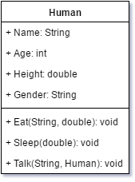
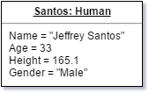

Unit 04: User-Defined Data Types, _An Introduction to Object-Oriented-Programming_

Lesson 01: An Introduction to Classes & Objects
***

Definitions:
---

**Definition: Object**

An *object* is a collection of data (*attributes*) and behaviors (*methods*).

_Note_: Often, the behaviors of an object act based on the data carried by the object.

**Definition: Class**

A *class* is a definition for a collection of objects detailing expected attributes and methods.

A *class* represents a new _data type_ representing complex combinations of different data and the operations that can be performed on that data.

We say that an object is **an instance of** a class.

***

Example: The `Human` Class
---

The `Human` class will be used to represent expected attributes and methods for a human-being:

**Human**:

_Attributes_
* Name
* Age
* Height
* Gender

_Methods_
* Eat()
* Sleep()
* Talk()

_Note:_ When we are creating classes such as the `Human` class above, we often note potential data types for attributes, method parameters, and method return types. A modified version of the `Human` class can be seen below:

**Human**:

_Attributes_
* Name: String
* Age: int
* Height: double
* Gender: String

_Methods_
* Eat(String, double): void
* Sleep(double): void
* Talk(String, Human): void

_Note #1:_ In this example, we are using Java-specific data types as that will be the language of implementation. In general, these data types will be understood by programmers of other languages, so they should work find even if the `Human` class needs to be implemented in other languages.

_Note #2:_ Notice that in `Talk()`, we are specifying a parameter of type `Human`. Remember, a class represents the definition for a new data type.
***

`Human` Objects:
---

Below, we specify an object named `Santos` as an **instance of** the `Human` class:

**Santos: Human**

_Attributes_
* Name = "Jeffrey Santos"
* Age = 33
* Height = 165.1
* Gender = "Male"

_Note_: Because methods represent operations on an object's data, they are not usually unique to an object, but rather to the class the object is an instance of. Because of that, we can shorten our object definitions by not including those methods. Note that this is a shortcut only. Those methods still exist and work for the `Santos` object (as well as every other `Human` object)!

***
**Exercise:** Create an object definition similar to the one above for yourself and/or a close family member.
***

UML Diagrams
---
A **U**niversal **M**odeling **L**anguage diagram is a special type of diagram designed to convey useful information about a computer system. There are a number of different types of UML diagrams. 

A _class diagram_ conveys useful information about a class. Below is the UML Class Diagram for the `Human` class.

Note:
* The class name is centered and bold at the top of the class definition.
* Horizontal lines separate the class name, the attributes, and the methods.
* A "+" symbol is used to denote a `public` attribute. This will be discussed at a later time.
* Attribute, Parameter, and Return types are denoted as previously.

An _object diagram_ is used to convey information about an exemplar object. These are rarely used to detail _every_ object in a system, rather, they are used to show typical examples and/or important objects. The `Santos` object is shown below.

Note:
* The object and class names are centered, bold, and underlined at the top of the object definition using the `ObjectName: ClassName` format seen previously.
* A horizontal line separates the object and class name from the attribute values.
* The attributes are essentially a list of Name/Value pairs as seen previously.

***
**Exercise:** Use [draw.io](http://www.draw.io) to create a class diagram for a `Dog` class. Additionally, create an exemplar object diagram for a `Dog`.
***