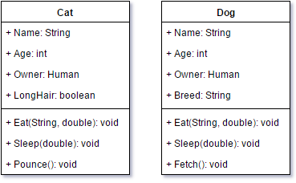
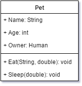
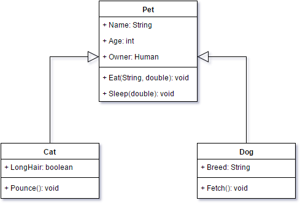
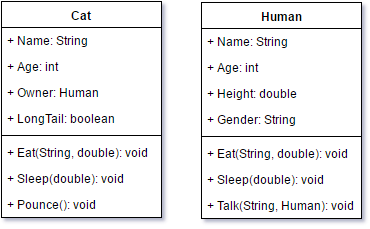
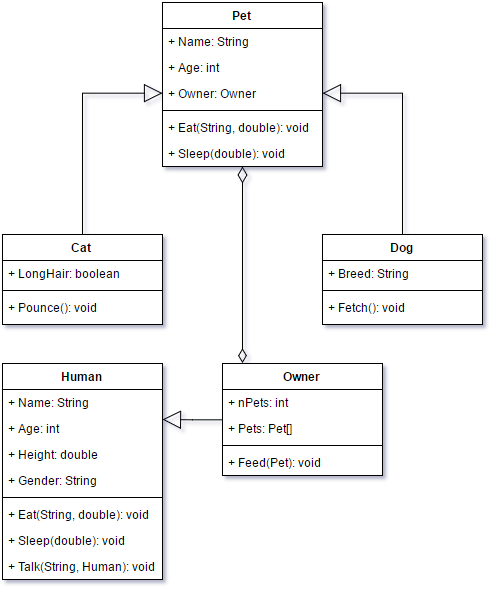

Unit 04: User-Defined Data Types, _An Introduction to Object-Oriented-Programming_

Lesson 02: Class Relationships
***

Related Classes
---

Consider the following two example classes, `Cat` and `Dog`:

You'll notice that `Cat` and `Dog` contain a very similar list of attributes and methods. Additionally, there are systems that could be devised (such as a Pet registration system for Woodstock) that might need to be able to fluidly operate on both classes. In this case, we have a number of different options:

1. We can create the `Cat` and `Dog` class as described in the UML diagrams.

| Pros | Cons |
| --- | --- |
| All information about a `Cat` or `Dog` is contained in the individual classes. | Systems need to be created to handle both instances as necessary. |
| Deeper analysis of these common attributes and/or methods does not need to take place. | Systems handling these two classes might need to be expanded to handle additional classes as necessary, even for common purposes (i.e., the Pet registration mentioned earlier). |
| | Adding additional common attributes and/or methods requires changing both classes. |
| | Changing implementation details of the common attributes and/or methods requires changing both classes. |

2. We can create a _class hierarchy_ using _class inheritance_.

| Pros | Cons |
| --- | --- |
| Maintenance of common attributes/methods (including adding and modifying implementation) is all done in a single location. | Understanding all of a class' attribute/methods requires examining multiple classes and files. |
| Systems can be designed to handle the _parent class_ of the hierarchy, allowing for greater flexibility. | Requires more robust programming systems in order to handle automatic inheritance of common attributes/methods. |
| This follows the "don't repeat yourself" mentality of many modern programming paradigms. | |

***

Class Inheritance
---

When two (or more) closely related classes share attributes and/or methods, we can strip out these common attributes and methods and place them in a _parent class_. This is known as _subclassing_ and creates a _class heirarchy_ through _inheritance_.

Consider the `Cat` and `Dog` classes above. These classes share the attributes {`Name`, `Age`, `Owner`} and methods {`Eat()`, `Sleep()`}. Under these circumstances, we might want to create a new class, let's call it `Pet` and place these common attributes and methods in its definition.

We can then create `Cat` and `Dog` as _sub classes_ of the `Pet` class.\
_Note:_ The method by which we implement class inheritance is highly dependent on the programming language being used. We will be discussing implementation details in Java at a later date. Below is the method of denoting class inheritance in a UML diagram.

_Note:_ Notice that the `Cat` and `Dog` classes no longer contain their shared attributes and methods. These now exist in the `Pet` class and are automatically inherited by the `Cat` and `Dog` classes. This means that `Cat` and `Dog` now contain these attributes and methods _because_ they are part of their parent class, `Pet`.

_Caution:_ One thing that often confuses first-time users of UML diagrams is the arrow styles in use. These are set by the UML specification. In particular, the end style of the arrow is important as well as the fact that the arrow points _towards the parent class_.
***

Definitions
---

We've been using some terms already, here's a list of the new terms you should be familiar with and a basic description of each.

**Parent Class** (**Super Class**): This is a class that contains shared attributes and/or methods that get automatically inherited by other classes through subclassing.

**Sub Class** (**Child Class**): This is a class that inherits attributes and/or methods from a parent class through subclassing.

**Subclassing** (**Class Inheritance**): This is the process of creating a class hierarchy through which attributes and/or methods are inherited from a parent class to a child class.

***

The "is-a" Class Relationships
---

Consider the original `Cat` and `Human` classes:

You'll notice there are a number of shared attributes, {`Name`, `Age`}, and methods, {`Eat()`, `Sleep()`}. Does that mean there should be a parent class of `Cat` and `Human` created?\
The answer: it depends.

One way to test if a class should be a sub class of a given parent class is to apply the "is-a" relationship test. Consider the following two statements:

1. `Cat` _is a_ `Pet`
2. `Human` _is a_ `Pet`

Clearly, the first statement "makes sense" while the second one does not. Because of that, `Cat` should be a sub class of `Pet` while `Human` should not be.\
_Caution:_ This method only tests whether or not a given class should be a sub class of another given class. That is, it does not suggest that `Human` should not be a sub class of _any_ other class, just not of the `Pet` class.

Does this mean that `Cat` and `Human` are never going to be sub classes of the same parent class? Not really. Imagine, for instance, a piece of software keeping track of different animals. `Cat` and `Human` could very well share a common parent of `Mammal` (note that `Human` _is a_ `Mammal` now makes sense). This leads to the following important consideration:

_Designing a system of classes should take the scope of the software system into account._

In other words, you don't need to create _every_ possible parent and child relationship within your software system, just the ones that make sense for the context in which you are using your system.

In our previous example of a Woodstock Pet Registry, for instance, you might want a `Human` owner and a `Cat` and `Dog` `Pet`, but you don't need to concern yourself that `Human`, `Cat`, and `Dog` are all different animals and, as such, don't need to create a more generic `Animal` class.

***
**Exercise:** Create an `Owner` subclass of the `Human` class. What new attributes and/or methods should be included that don't belong in the more generic `Human` class?

Use [draw.io](http://draw.io) to create the relevant UML class diagram.
***

The "has-a" Class Relationship
---

You'll notice from our previous `Pet` diagrams that `Pet` has an attribute of type `Human` (in fact, we are going to change this to type `Owner` now that you've created this class). In this case, we can say that a `Pet` _has a(n)_ `Owner`.

Likewise, you might have had an attribute of type `Pet` in your `Owner` class (as our example `Owner` below does). In this case, we can once again say that an `Owner` _has a_ `Pet`.

When one class has attributes that are objects of another class, we say that class _aggregates_ the other in a relationship known as _class aggregation_. Most programming languages (as does Java) support class aggregation through simple attribute declaration; however, UML diagrams provide for a special notation showing this type of relationship.

Below is a UML diagram showing all of the classes and class relationships heretofore discussed (including a sample `Owner` class).

_Note:_ The arrow style for aggregation is an open diamond. Normally, the arrow head points to the aggregator; however, due to the fact that both Pet and Owner aggregate each other, notice that the open diamond arrow head is pointing to both classes.

***
**Exercise:** Create an additional class that a `Pet` might aggregate. Recreate the above UML diagram (you may use your own `Owner` class if you wish) and add your new class to it.
***
